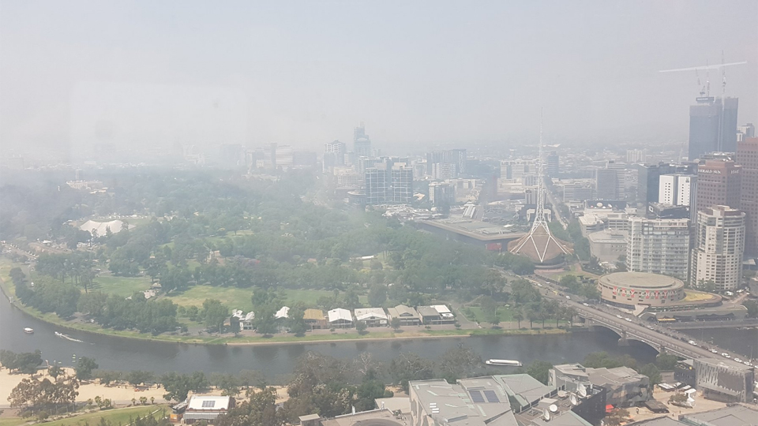
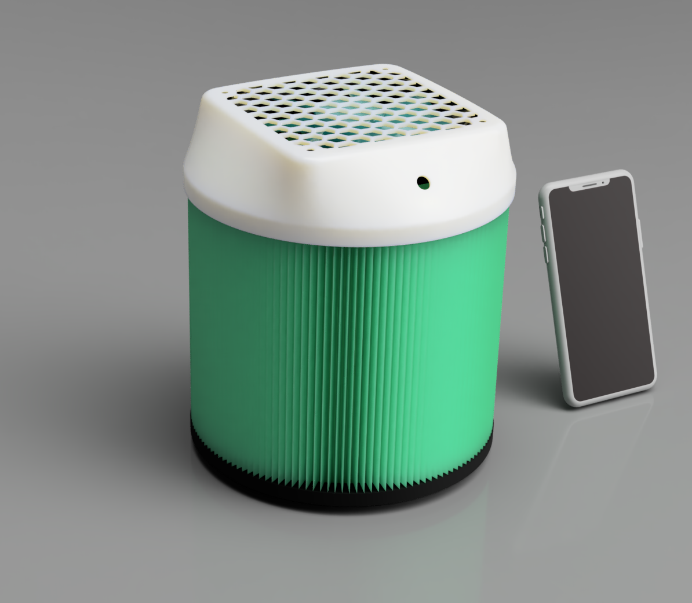
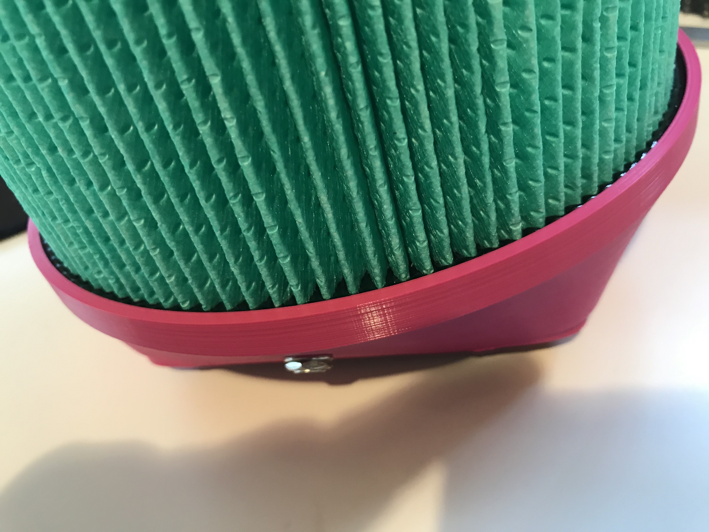
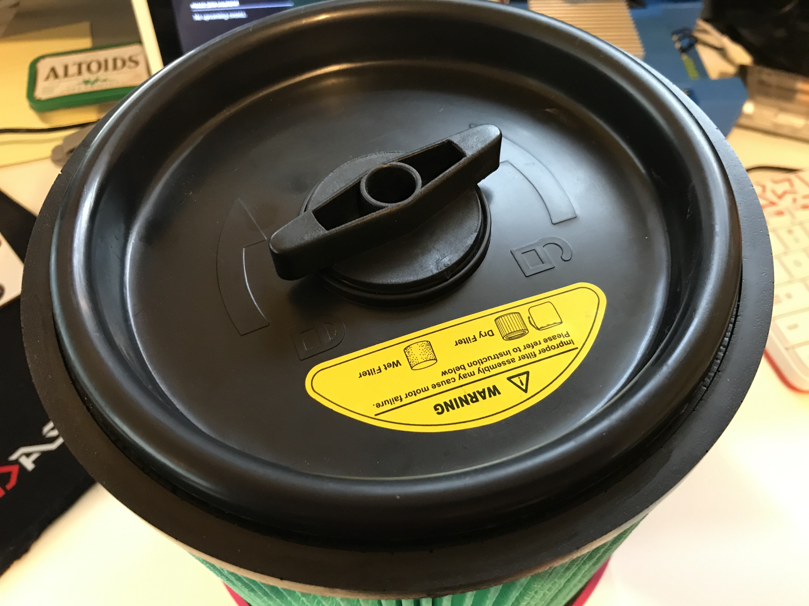
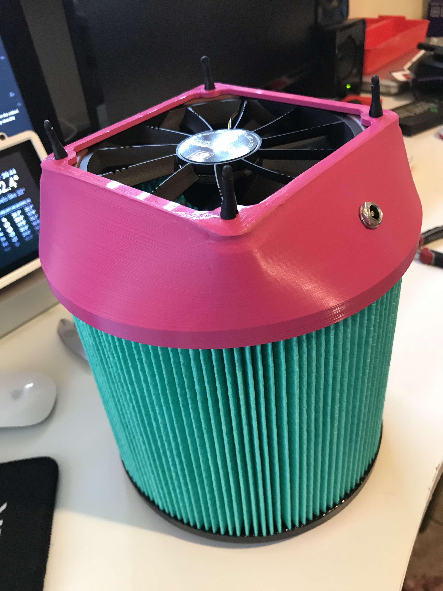
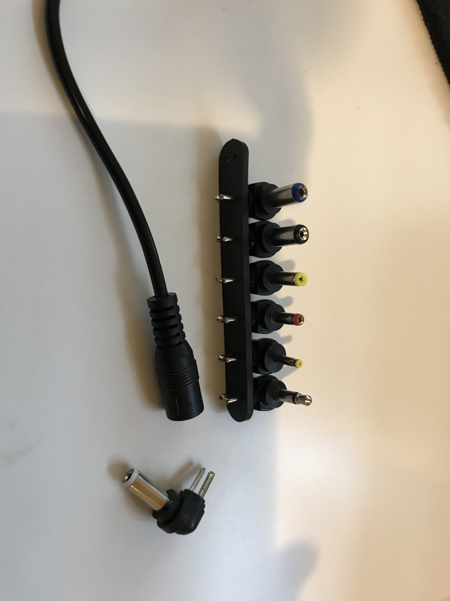
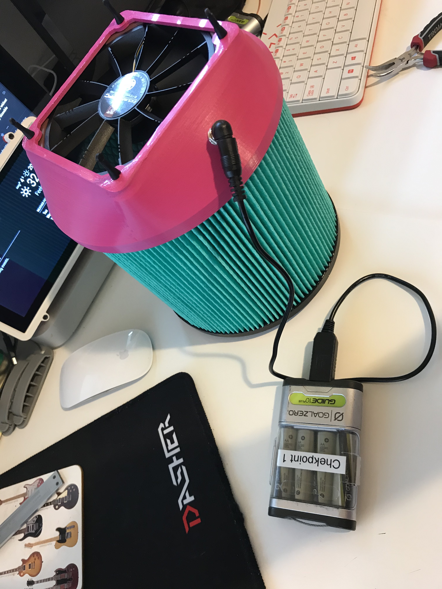

# DIY-Air-Purifier
A small DIY air purifier using off-the-shelf components for &lt;$100.

Time to assemble this project - 1hr (not including 3D print time).

Uses a 3D printed housing so you'll need a printer or access to one. You could use a printing service such as 3D Hubs.

All prices listed are in AUD.

## Background

In the summer of 2019/2020 Australia is experiencing unprecedented dangerous fire conditions driven by climate change. Much of the east coast of the country south of Brisbane is engulfed in deadly bushfires and air pollution ratings in cities such as Sydney, Canberra, Melbourne and many other regional cities and towns is many times the recommended safe levels of PM2.5 particles. The long term affects of the inhalation of bushfire smoke is mostly unknown at this time, but already people have died from respiratory distress bought about by the smoke-filled air.

There has been a great deal of discussion online and in the media about the use of P2 respirators and home air purifiers to reduce the effects of the bushfire smoke. However, information about the efficiacy of P2 respirators for bushfire smoke is not readily available and what information can be found suggests they may be of limited use. Health officials are continuing to recommend eliminating exposure to PM2.5 particles and bushfire smoke-related chemicals by remaining indoors if possible. Unfortunately for many people the summer heat makes indoors extremely uncomfortable and the evaporative air conditioners installed in many homes in my state of Victoria do not filter the damaging PM2.5 particles from the air. Health officials recommend using HEPA H13 air purifiers, however these are extremely expensive with even a basic unit suitable for a single room costing around $500.

With all this in mind I set about finding a way to build a low-cost, effective air purifier that would meet the minimum requirement to filter PM2.5 particles in a bedroom, so that children and at-risk people could at least sleep without inhaling these dangerous airborne contaminants.

This github sets out the process I followed to construct and test the device, as well as the BOM and 3D print STL files for recreating the device.

## Purpose
The purpose of this project is to create a small air purifier suitable for a bedroom or caravan (or similar sized space) that meets the following critiera:
  - Costs under $100 to build (in parts);
  - Can be constructed with relatively low levels of technical skill (there is soldering of two wires required);
  - Uses off-the-shelf components available in most Australian cities, or by order over the internet from Australian suppliers; and
  - Uses a HEPA H13 rated filter; and
  - Is powered from a commonly available USB powerbank.

## Method
I selected a readily available HEPA H13 rated filter normally used in cheap vacuum cleaners and available from Bunnings Warehouse. The rest of the air purifier is based around that filter. I then selected a range of 120mm computer fans with relatively high static pressure ratings (>2.0 mmAq) that could operate on 12vDC. As the fans are 12vDC I used a USB 'booster cable' which steps-up the voltage of any USB-A port from 5v to 12v; these cables are available online or from a range of electronics shops such as Jaycar.
After selecting the components I then designed a fan housing using Fusion 360 that provides the interface between the 120mm and the HEPA filter. The filter comes with a removable seal/cover at one end, so I use that end as the base of the unit and fit the fan to the top.
After basic testing with a small smoke generator to ensure the selected fans could draw air through the filter to a reasonable standard I have determined the project suitable for release so others can create their own version of this device both for use in their homes and for further testing.

The image above shows the rendered view of the device from Fusion 360 with an iPhone X for scale. The first version of the housing used a separate fan grill but I was able to eliminate this by incorporating the hex pattern into the housing, which also saved about $7 off the cost.

## Materials
The BOM for the air purifier is:
  - 1x 120mm computer fan. I recommend you use this one: https://www.pccasegear.com/products/36033 which draws around 600ma, or if you have a larger power bank this one: https://www.pccasegear.com/products/27866 which draws around 1000ma but pushes a lot more air. The second fan is also a bit more expensive so if the budget is tight the first one will work perfectly.
  - 1x 2.5mm DC bulkhead socket: https://www.jaycar.com.au/2-5mm-bulkhead-male-dc-power-connector/p/PS0524. This allows you to plug the device in with the USB booster cable to supply 12vDC to the fan.
  - 1x 12v USB booster cable: https://www.jaycar.com.au/universal-usb-12v-step-up-power-cable/p/PP1978 Ensure you get the 12v version as these do come in 9v also and that wont work.
  - 1x HEPA H13 filter: https://www.bunnings.com.au/powerfit-h13-hepa-cartridge-filter_p6210793. Ensure you get this exact filter as the housing is dimensioned to fit over the end. Other filters with the same diameter may work, but are untested. This filter comes with an end-piece that will be the base of your device, so ensure this is in the box.
  - 1x USB power bank. Any power bank that can supply 5v >1amp will work but for best results choose one at least 10,000maH that supports pass-through charging. This allows you to use the battery as a UPS for the air purifier and run it continuously from a mains power, with  the battery being used for power outages.
  - 1x 3D printed fan housing. The STL file can be found in: [fan_housing](https://github.com/Kels316/DIY-Air-Purifier/blob/master/3D_print_files/fan_housing.stl)
  - 4pin fan cable: https://www.pccasegear.com/products/35666/cablemod-4-pin-fan-to-3x-4-pin-fan-y-cable-black-30cm. This cable is cheap and gives you three female plugs so you can make multiple devices with the one cable.
  - Heatshrink tubing 8mm (30mm long).
  - 4x rubber fan screws: https://www.pccasegear.com/products/34741/noctua-black-chromax-anti-vibration-mounting-bolts-20-pack. These unfortunately only come in a pack of 20, so you may find them in smaller amounts at other outlets. Alternatively you can use 4mm screw heat bolts and nuts, you will need to check the length you need depending on the thickness of your fan. For the fans I linked above you would need 30mm bolts.

## Tools
You will need the following tools to assemble the device:
  - Soldering iron and solder
  - Pliers (with wire cutters)
  - Scissors
  - Multimeter (to determine correct polarity for the wiring of the socket)
  
## Assembly
### Step 1
Assemble the wiring harness for the 2.5mm socket.
- Take the 4pin fan cable and cut one of the female plugs off leaving about 10cm of cable on the plug.
- Trim back the cable protective sleeve with the scissors leaving about 2cm of exposed wires.
- If you use the cable I linked above to make this harness you need the orange (+) and black (-) wires, other cables may differ so check before you go further you have the correct wires.
- Keeping the orange and black wires the length you cut previously, cut the other two wires off shorter so they will be inside the cable sheath and out of the way.
- Strip and tin the orange and black wires with new 60/40 solder and place on the heatshrink tubing over the top of the cable protective sheath.
- Determine the correct terminal lugs on the 2.5mm socket using the multimeter. Then solder the + and - wires to the correct terminals.
- Pull the heatshrink over the socket lugs and shrink it with a heat gun or flame.
- The completed wiring harness should look similar to this

### Step 2
Assemble the fan housing.
- Take the 3D printed housing and insert the 2.5mm socket from the inside, and fix in place using the supplied washer and nut. Tighten down with your pliers so it is snug but don't go crazy, you don't want to crack the housing.
- Place the fan inside the housing with the writing facing towards the square end, this will ensure the fan draws air through the filter rather than pushing air into the filter. It wont make a huge difference to the performance of the device, but it's good practice to have clean air running over the fan. Use the 4 rubber fan mounts (or bolts if you use that method) to fix the fan into the case, then plug the fan cable into the wiring harness from step 1.

### Step 3
Assemble the device.
- Take the fan housing assembly and place it over the open end of the HEPA filter, taking care to work around the edge of the rubber ring on the filter itself so a good seal is make on the inside of the housing.
- Ensure the base cover is installed firmly in the filter housing.
(note the images below are of an early version with no integrated fan grill, the assembly is identical otherwise. I'll update these with better images later)

### Step 4
Power up and test.
- Assemble the USB cable with the 2.5mm plug. In the kit linked above it is the largest suppled plug, with the white tip.

- Plug the cable into the device and your USB power bank and the fan should start running. If the fan doesn't work you should begin troubleshooting. Start with checking your powerbank is charged and turned on to supply power. I have a couple of battery packs that don't work to supply power to the air purifier, even though they are rated well above the requirement, I'm not sure why but it seems like some devices can't supply the surge current required to start the fan.
- Note that not all power banks can support pass-through charging and depending on the fan you select you may find the pack cannot charge faster than you run it down. The more expensive fan I linked above will draw around 1amp or a little above, and if you use this fan you need to make sure your charger can supply above 1amp (comfortably) to keep your battery charged. The power bank in the image below is one I use for testing in my office, it's not suitable to run the device for long periods.

## Final remarks
This is a DIY project requiring basic skills including soldering. Selecting an appropriate power supply will require some basic knowledge of electricity. I've tried to keep everything as simple as possible and this isn't a consumer-grade product. Other than testing to ensure the fan drew air through the filter I have not tested this device for effectivenes in filtering harmful airborne contaminants. You should build and use this device at your own risk, no liability is implied or accepted.

## Request for assistance
If you can assist with improving this project by more rigorous testing using a PM2.5 meter or other instrumentation then please get in touch with me at info@phasezero.com.au or via this repo.

### Licence
This work is licenced under a Attribution-NonCommercial-ShareAlike 3.0 Australia licence. 
[https://creativecommons.org/licenses/by-nc-sa/3.0/au/](https://creativecommons.org/licenses/by-nc-sa/3.0/au/)
